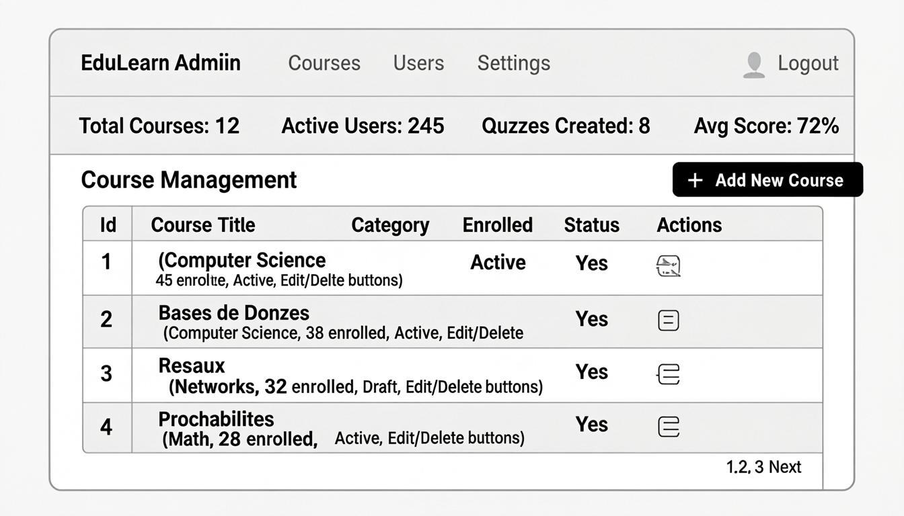
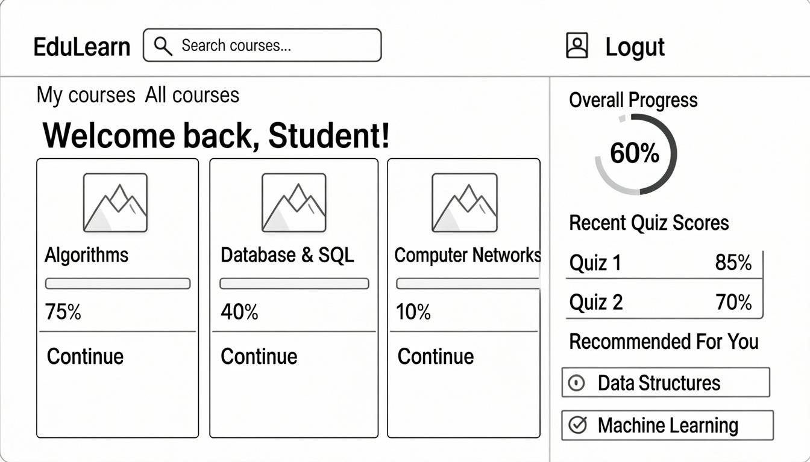
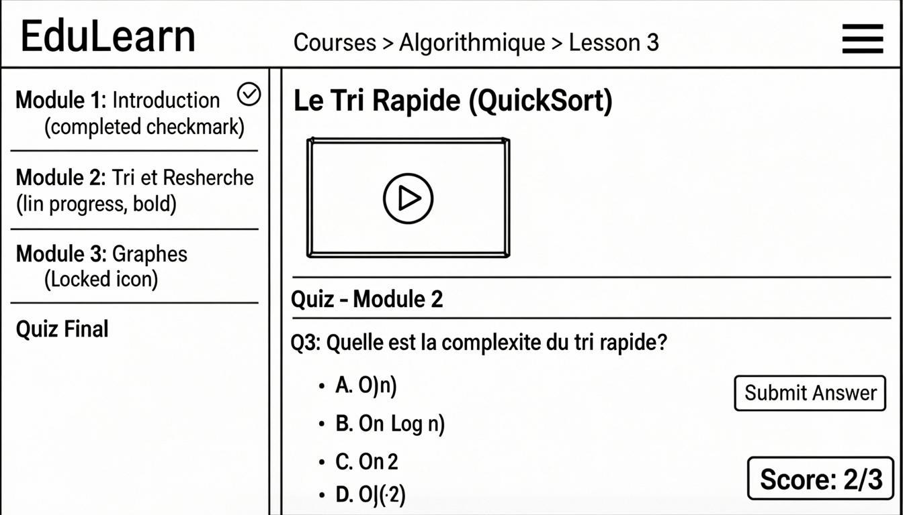

<div align="center">

# EduLearn

## Plateforme E-Learning Simplifiée

**Livrable 1 : Mini-Cahier des Charges ·**

<br><br>

**Faculté des Sciences · Université Mohammed V de Rabat**

| Role | Nom(s) |
|:---:|:---|
| Chef de Projet | **Haitam** |
| Product Owner | **Soufian** |
| Développeurs / Testeurs | **Smail & Younes** |

</div>

---

**Table des Matières**

1. [Contexte](#1--contexte)
2. [Parties Prenantes](#2--parties-prenantes)
3. [Périmètre · Priorisation MoSCoW](#3--périmètre--priorisation-moscow)
4. [Contraintes](#4--contraintes)
5. [Dépendances Externes](#5--dépendances-externes)
6. [Cas d'Utilisation](#6--cas-dutilisation)
7. [Architecture Technique](#7--architecture-technique)
8. [Risques](#8--risques)
9. [Glossaire](#9--glossaire)
10. [Hypothèses et Exclusions](#10--hypothèses-et-exclusions)
11. [KPIs · Indicateurs Clés de Performance](#11--kpis--indicateurs-clés-de-performance)
12. [Planification Macro](#12--planification-macro)
13. [Critères de Succès](#13--critères-de-succès)
14. [Wireframes · Écrans Annotés](#14--wireframes--écrans-annotés)

---

## 1 · Contexte

### 1.1 Situation Actuelle

L'enseignement supérieur marocain fait face à une problématique croissante d'accès aux ressources pédagogiques. Les étudiants de la **Faculté des Sciences de l'Université Mohammed V de Rabat** n'ont pas de plateforme unifiée pour consulter les cours en ligne, tester leurs connaissances ou interagir avec les contenus pédagogiques en dehors des heures de présentiel.

Actuellement, les ressources sont **dispersées** sur plusieurs canaux non centralisés :

| Canal | Limite |
|:---|:---|
| Emails | Pas de structure, recherche difficile |
| Groupes WhatsApp | Pertes de fichiers, pas de suivi |
| Google Drive | Non structuré, pas de progression |

> **Note :** Cette fragmentation entraîne une perte de temps estimée à **2 à 3 heures par semaine** par étudiant pour retrouver les cours.

### 1.2 Problème Résolu

EduLearn **centralise** l'accès aux cours, aux évaluations et au suivi de progression dans une interface unique et accessible depuis n'importe quel appareil connecté.

### 1.3 Valeur Ajoutée Chiffrée

| Impact | Métrique |
|:---|:---|
| Réduction du temps de recherche | **-70%** du temps de recherche de ressources |
| Disponibilité des contenus | **24h/24 · 7j/7** |
| Taux de complétion de cours | **+40%** grâce aux quiz de validation |
| Suivi enseignant | En **temps réel** |
| Fonctionnalités couvertes | **3 fonctionnalités majeures** · 4 étudiants · 12 séances |

---

## 2 · Parties Prenantes

Le tableau suivant identifie les **cinq parties prenantes** du projet EduLearn, leurs besoins et leur niveau d'implication :

| # | Rôle | Partie Prenante | Besoins | Implication |
|:---:|:---|:---|:---|:---|
| 1 | **Client fictif** | Université / Établissement de formation | Plateforme pédagogique centralisée, suivi des apprenants | Validation des fonctionnalités, retours sur l'architecture |
| 2 | **Utilisateur final** | Étudiants inscrits | Accès simple aux cours, quiz interactifs, suivi de progression | Tests utilisateurs, feedback UX |
| 3 | **Administrateur** | Admin système | Gestion des utilisateurs, ajout/suppression de cours et contenus | Maintenance quotidienne de la plateforme |
| 4 | **Enseignant** | Corps enseignant | Publication de cours, suivi des résultats aux quiz | Création de contenu, validation pédagogique |
| 5 | **Équipe projet** | Haitam, Soufian, Smail, Younes | Livrer un produit fonctionnel conforme aux exigences | Développement complet, tests, documentation |

---

## 3 · Périmètre · Priorisation MoSCoW

Les fonctionnalités sont classées selon la méthode **MoSCoW**. Le périmètre couvre **12 fonctionnalités** couvrant les besoins essentiels et optionnels de la plateforme.

### MUST HAVE — Indispensable

| ID | Fonctionnalité | Description |
|:---:|:---|:---|
| **F1** | Authentification | Inscription, connexion sécurisée (JWT + HTTPS), déconnexion |
| **F2** | Consultation des cours | Accès à la liste des cours, lecture de contenu (texte, vidéo, PDF) |
| **F3** | Gestion du contenu (Admin) | L'admin peut ajouter, modifier et supprimer des cours et ressources |

### SHOULD HAVE — Important

| ID | Fonctionnalité | Description |
|:---:|:---|:---|
| **F4** | Quiz / Évaluation | Répondre à des quiz avec calcul automatique du score |
| **F5** | Tableau de bord étudiant | Suivi de la progression, historique des cours consultés et scores |

### COULD HAVE — Optionnel

| ID | Fonctionnalité | Description |
|:---:|:---|:---|
| **F6** | Profil utilisateur | Modification des informations personnelles et mot de passe |
| **F7** | Recherche de cours | Barre de recherche et filtres par catégorie/module |
| **F8** | Notifications | Alertes pour nouveaux cours ou résultats de quiz |

### WON'T HAVE — Hors Périmètre

| ID | Fonctionnalité | Description |
|:---:|:---|:---|
| **F9** | Messagerie interne | Chat entre étudiants et enseignants |
| **F10** | Certification | Génération de certificats de réussite automatisés |
| **F11** | Application mobile native | Version iOS/Android dédiée |
| **F12** | Paiement en ligne | Module de paiement pour cours premium |

> **Répartition :** 3 Must · 2 Should · 3 Could · 4 Won't

---

## 4 · Contraintes

### 4.1 Contraintes Techniques

| Composant | Technologie | Détail |
|:---|:---|:---|
| **Front-end** | React.js | Composants réutilisables, SPA |
| **Back-end** | Node.js + Express.js | API RESTful |
| **Base de données** | MongoDB | NoSQL, flexible pour les contenus pédagogiques |
| **Hébergement Front** | Vercel | CDN global |
| **Hébergement Back** | Render / Railway | API en production |
| **Communication** | HTTPS | Obligatoire |
| **Authentification** | JWT | JSON Web Tokens |

### 4.2 Contraintes de Délai

| Contrainte | Valeur |
|:---|:---|
| Durée totale du projet | **12 séances** (S1 à S12) |
| Livraison finale (V1.0) | Avant la **Séance 12** |
| Estimation COCOMO | **6.33 mois** — ajusté à 12 séances par parallélisation |

### 4.3 Contraintes de Sécurité

| Mesure | Implémentation |
|:---|:---|
| Mots de passe | Hachés via **bcrypt** |
| Tokens JWT | Expiration à **24h** |
| Validation | Côté serveur de **toutes** les entrées utilisateur |
| Protection | Contre injections **XSS** et **CSRF** |

---

## 5 · Dépendances Externes

| Service / API | Usage | Risque si indisponible | Alternative |
|:---|:---|:---|:---|
| **MongoDB Atlas** | Stockage de données (cours, utilisateurs, scores) | Perte d'accès à toutes les données | MongoDB local / PostgreSQL |
| **Vercel** | Déploiement du front React (Hébergement) | Site inaccessible en production | Netlify / GitHub Pages |
| **Cloudinary / AWS S3** | Stockage des fichiers PDF et vidéos multimédias | Impossibilité d'uploader des contenus | Système de fichiers local |
| **npm Registry** | Installation des dépendances (React, Express, etc.) | Blocage du développement local | Cache local des packages |
| **GitHub** | Gestion du code source, CI/CD pipeline | Perte de versioning et collaboration impossible | GitLab / Bitbucket |

---

## 6 · Cas d'Utilisation

### 6.1 CU-01 · Inscription et Connexion

| Attribut | Valeur |
|:---|:---|
| **Acteur** | Étudiant non inscrit |
| **Précondition** | L'utilisateur n'a pas encore de compte EduLearn |

**Déroulement :**

1. L'utilisateur accède à la page d'accueil
2. Il clique sur « S'inscrire »
3. Il renseigne nom, email, mot de passe
4. Le système valide les données et crée le compte
5. L'utilisateur reçoit une confirmation et est redirigé vers le tableau de bord

**Résultat :** Compte créé, session ouverte, accès au tableau de bord

**Cas d'erreur :**
- Email déjà utilisé : message d'erreur
- Mot de passe trop court : validation front-end
- Email invalide : rejet formulaire

---

### 6.2 CU-02 · Consultation d'un Cours

| Attribut | Valeur |
|:---|:---|
| **Acteur** | Étudiant connecté |
| **Précondition** | L'étudiant est authentifié et dispose d'un accès actif |

**Déroulement :**

1. L'étudiant accède à la liste des cours
2. Il filtre ou recherche un cours par module
3. Il clique sur un cours pour l'ouvrir
4. Le système charge le contenu (PDF, vidéo ou texte)
5. L'étudiant consulte la ressource et la progression est mise à jour

**Résultat :** Contenu affiché, progression de l'étudiant mise à jour en base de données

**Cas d'erreur :**
- Fichier non trouvé : message d'erreur avec lien de signalement
- Connexion perdue : affichage du contenu mis en cache

---

### 6.3 CU-03 · Passage d'un Quiz

| Attribut | Valeur |
|:---|:---|
| **Acteur** | Étudiant connecté |
| **Précondition** | L'étudiant a consulté le cours associé au quiz |

**Déroulement :**

1. L'étudiant accède à l'onglet « Quiz » du cours
2. Il lance le quiz (questions à choix multiples)
3. Il répond à chaque question et valide
4. Le système calcule le score et l'affiche
5. Le score est enregistré dans le profil de l'étudiant

**Résultat :** Score calculé et affiché, résultat enregistré, badge de réussite accordé si score > 70%

**Cas d'erreur :**
- Quiz sans réponse : validation impossible
- Timeout de session : score partiel sauvegardé
- Serveur indisponible : tentative de reprise

---

## 7 · Architecture Technique

EduLearn repose sur une architecture **3 couches (N-Tier)** classique, adaptée à un déploiement cloud moderne :

```
+-----------------------------------------------------------+
|              COUCHE PRESENTATION · Front-end               |
|                    React.js (SPA)                         |
|   React Hooks · React Router v6 · Axios                   |
|   Hebergement : Vercel (CDN global)                       |
+----------------------+------------------------------------+
|              COUCHE METIER · Back-end                     |
|               Node.js + Express.js                        |
|   API RESTful · JWT + bcrypt · Middleware securite         |
+----------------------+------------------------------------+
|              COUCHE DONNEES · Base de donnees             |
|                    MongoDB Atlas                          |
|   Mongoose (ODM) · Collections : Users, Courses,         |
|   Quizzes, Results · Cloudinary (fichiers)               |
+-----------------------------------------------------------+
```

### 7.1 Couche Présentation · Front-end (React.js)

| Élément | Technologie |
|:---|:---|
| Gestion des états | React Hooks (`useState`, `useEffect`, `useContext`) |
| Routing côté client | React Router v6 |
| Appels API | Axios |
| Hébergement | Vercel (CDN global, déploiement continu depuis GitHub) |

> **Justification :** React offre une expérience fluide sans rechargement de page, idéale pour une plateforme de cours.

### 7.2 Couche Métier · Back-end (Node.js + Express)

| Élément | Technologie |
|:---|:---|
| Runtime | Node.js avec framework Express.js |
| API | RESTful — endpoints CRUD pour users, cours, quiz, scores |
| Authentification | JWT (`jsonwebtoken`) + bcrypt |
| Middleware | `cors`, `helmet`, `express-validator` |

> **Justification :** Node.js est cohérent avec React (JavaScript fullstack), performances élevées pour les I/O.

### 7.3 Couche Données · Base de données (MongoDB)

| Élément | Détail |
|:---|:---|
| SGBD | MongoDB Atlas (NoSQL orienté documents) |
| ODM | Mongoose (schémas flexibles, validation) |
| Collections principales | `Users`, `Courses`, `Quizzes`, `Results` |
| Stockage fichiers | Cloudinary pour PDFs et vidéos |

> **Justification :** MongoDB est adapté aux structures imbriquées (cours avec modules et quiz) sans jointures complexes.

---

## 8 · Risques

| # | Risque | Probabilité | Impact | Stratégie de Mitigation |
|:---:|:---|:---:|:---:|:---|
| **R1** | Indisponibilité de MongoDB Atlas (cloud) | Faible | Élevé | Mise en place d'une instance MongoDB locale pour le développement. Sauvegardes quotidiennes des données. |
| **R2** | Retard dans le développement dû à des conflits Git | Moyen | Moyen | Utilisation de branches Git par fonctionnalité (GitFlow), revue de code systématique avant merge. |
| **R3** | Dépassement du délai d'estimation COCOMO (6.33 mois vs 12 séances) | Moyen | Élevé | Réduction du périmètre aux fonctionnalités Must have, parallélisation des tâches indépendantes. |
| **R4** | Difficultés techniques avec la gestion des fichiers multimédias | Moyen | Moyen | Utilisation de Cloudinary (API clé en main). Fallback sur stockage local si nécessaire. |
| **R5** | Abandon d'un membre de l'équipe | Faible | Élevé | Documentation continue du code, répartition équitable et connaissance croisée des modules. |

---

## 9 · Glossaire

| Terme | Définition dans le contexte EduLearn |
|:---|:---|
| **JWT** (JSON Web Token) | Mécanisme d'authentification stateless utilisé pour sécuriser les sessions utilisateur sans stocker l'état côté serveur. EduLearn génère un JWT à la connexion, valable 24h. |
| **SPA** (Single Page Application) | Architecture d'application web où une seule page HTML est chargée initialement, puis le contenu est mis à jour dynamiquement par React sans rechargement complet. |
| **API REST** | Interface de programmation basée sur les standards HTTP. EduLearn expose des endpoints `/api/courses`, `/api/quiz`, `/api/users` pour que le front communique avec le back-end. |
| **CRUD** | Acronyme pour **C**reate, **R**ead, **U**pdate, **D**elete — les quatre opérations de base de manipulation des données dans la base MongoDB. |
| **MoSCoW** | Méthode de priorisation : **M**ust have (indispensable), **S**hould have (important), **C**ould have (optionnel), **W**on't have (hors périmètre). |
| **Score Quiz** | Indicateur numérique (0-100%) calculé automatiquement après soumission d'un quiz. Un score >= 70% valide le module. |
| **Module** | Unité pédagogique regroupant un cours (PDF/vidéo) et son quiz d'évaluation associé, organisée par discipline. |
| **Progression** | Pourcentage de cours consultés et validés par un étudiant, affiché sur son tableau de bord personnel. |

---

## 10 · Hypothèses et Exclusions

### 10.1 Hypothèses

Ce que l'on suppose vrai :

1. Les étudiants disposent d'un **accès Internet stable** pour utiliser la plateforme
2. Les enseignants fourniront les contenus de cours au format **PDF ou vidéo**
3. L'équipe dispose d'accès aux outils gratuits : **MongoDB Atlas, Vercel, GitHub**
4. Le client fictif (université) **valide les maquettes wireframes** avant le développement
5. La plateforme sera utilisée par un nombre limité d'utilisateurs **(<500)** pendant la phase de démonstration

### 10.2 Exclusions

Ce que le projet **ne fait PAS** :

| Exclusion | Raison |
|:---|:---|
| Paiements en ligne / abonnements premium | F12 classée Won't |
| Application mobile native (iOS/Android) | F11 classée Won't |
| Messagerie instantanée étudiant-enseignant | F9 classée Won't |
| Module de visioconférence intégré | Hors périmètre |
| Certification automatique des parcours | F10 classée Won't |
| Intégration LMD / Apogée | Hors périmètre |

---

## 11 · KPIs · Indicateurs Clés de Performance

Les **5 KPIs** suivants seront mesurables et vérifiables lors de la soutenance finale (Séance 12) :

| # | Indicateur | Mesure | Cible | Méthode de Vérification |
|:---:|:---|:---|:---:|:---|
| **KPI1** | Taux de fonctionnalités Must livrées | Nombre de fonctionnalités Must have développées et live / Total Must have | **100% (3/3)** | Démonstration en soutenance |
| **KPI2** | Temps de réponse API | Temps moyen de réponse des endpoints principaux (GET /courses, POST /login) | **< 500ms** | Mesure avec Postman / console navigateur |
| **KPI3** | Taux de réussite aux quiz | Pourcentage d'étudiants testeurs obtenant un score calculé et affiché correctement | **100%** des cas testés | Tests fonctionnels documentés |
| **KPI4** | Couverture des tests API | Pourcentage des endpoints testés avec Jest ou Supertest | **>= 60%** | Rapport de tests automatisés |
| **KPI5** | Disponibilité du déploiement | Uptime de la plateforme en production (Vercel) lors de la démonstration | **>= 99%** | URL de production accessible en live |

---

## 12 · Planification Macro

Le projet s'étend sur **12 séances**, organisées en **5 grandes phases** :


| Phase | Séances | Activités Principales | Livrables | Responsable |
|:---:|:---:|:---|:---|:---:|
| **Ph.1 · Cadrage** | S1 a S2 | Fiche projet, Mini-CDC, WBS, estimation COCOMO, Gantt | Fiche projet + Mini-CDC complet | Haitam (Chef) |
| **Ph.2 · Conception** | S3 a S5 | Réseau PERT, Product Backlog, maquettes Figma, architecture BDD | Product Backlog v1 + Diagrammes | Soufian (PO) |
| **Ph.3 · Développement** | S5 a S9 | Sprint 0, Code source, features F1/F2/F3, intégration API, tests unitaires | Code source versionné GitHub, API fonctionnelle | Smail & Younes |
| **Ph.4 · Tests & Intégration** | S9 a S11 | Tests fonctionnels, CI/CD pipeline, correction bugs, déploiement staging | Rapport de tests, pipeline CI, déploiement Vercel | Toute l'équipe |
| **Ph.5 · Livraison** | S12 | Présentation finale, démonstration live, documentation technique | Application en production + rapport final | Haitam (Chef) |

---

## 13 · Critères de Succès

Les **5 conditions** suivantes doivent être vérifiées lors de la soutenance (Séance 12) pour considérer le projet comme réussi :

| # | Critère | Condition de Vérification Mesurable |
|:---:|:---|:---|
| **CS1** | Toutes les fonctionnalités Must have sont développées et fonctionnelles | L'inscription, la connexion, la consultation des cours et la gestion admin fonctionnent sans erreur lors de la démo live |
| **CS2** | La plateforme est déployée et accessible publiquement | L'URL Vercel est opérationnelle et accessible depuis n'importe quel navigateur le jour de la soutenance |
| **CS3** | Les quiz produisent un score correct pour au moins 5 cas de test | Démonstration de 5 scénarios de quiz avec vérification du calcul de score et enregistrement en base |
| **CS4** | Le code est versionné sur GitHub avec un historique de commits cohérent | Le dépôt GitHub public comporte au moins **20 commits** significatifs, répartis entre les membres |
| **CS5** | La documentation technique est complète et remise | Mini-CDC, WBS, Estimation, Gantt, backlog et README GitHub sont fournis et conformes aux consignes |

---

## 14 · Wireframes · Écrans Annotés

Les **3 wireframes** ci-dessous représentent les écrans correspondant aux fonctionnalités **Must have** prioritaires.

### Écran 1 — Inscription / Connexion



**Annotations :** Champ email avec validation format. Champ mot de passe masqué. Bouton CTA centré. Lien vers inscription. Message d'erreur sous le formulaire si identifiants invalides.

---

### Écran 2 — Liste des Cours




**Annotations :** NavBar persistante. Barre de recherche avec filtre par module. Cartes de cours avec icône type (PDF/vidéo), titre, bouton d'accès. Grille responsive 3 colonnes.

---

### Écran 3 — Quiz



**Annotations :** Barre de progression (questions répondues/total). Question numérotée en texte clair. 4 options à choix unique (radio buttons). Navigation précédent/suivant. Bouton « Soumettre » à la dernière question. Score affiché sur écran de résultat post-soumission.

---
